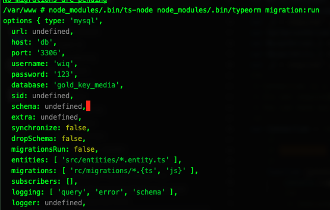

# typeorm-env-test

This issue persists in v0.2.9.

I added a console log of `options` in Connection's constructor https://github.com/typeorm/typeorm/blob/0.2.6/src/connection/Connection.ts#L118 for the example below 



I've used docker to be consistent with the environment that I found the issue in. I've also used nestjs to replicate the environment but that's completely separate to the issue.

I've added a migration file so running `node_modules/.bin/ts-node node_modules/.bin/typeorm migration:run` should run the file, however it's not found due to the issue. 

## Setup 

Run `yarn setup` to create your `.env` file and start the docker container. 

```bash
$ yarn setup
```

Use `yarn ash` to get into the container

```bash
$ yarn ash
```

or use the exec command on docker-compose (used in the above).

```bash 
$ docker-compose exec node ash
```

## Running 

In my dev environment at the time I was running everything from the ts files rather than the javascript files. I did run my js files but only when I was ready to deploy and test the deployment would work on kubernetes (yes save me...). So at the time I was running everything through ts-node. This issue persists without using ts-node. 

To see the output of the options, I added a console.log within the constructor of Connection which gave me the `migrations: ['src/migrations/*.{ts', 'js}']` result.

```ash
$ node_modules/.bin/ts-node node_modules/.bin/typeorm migration:run
```

The issue also persists with 

```ash
$ node_modules/.bin/typeorm migration:run
```

### Further weirdness

I also added speach marks around the `TYPEORM_MIGRATIONS` env in the env file but this resulted in the same result.

```
TYPEORM_MIGRATIONS="src/migrations/*.{ts,js}"
```
The result is `migrations: ['"src/migrations/*.{ts', 'js}"']`. (Don't forget trying this requires the container to be re-instanced with the new envs `docker-compose up -d --build --force-recreate node`)


> Let me know if there's anything else I can do! 